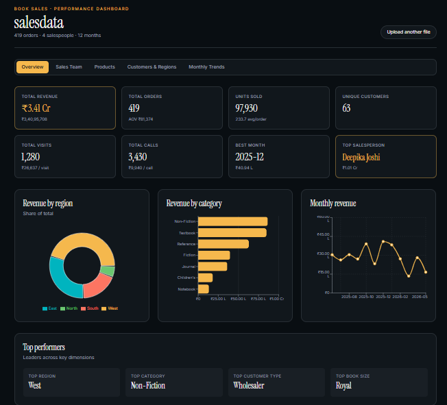

# Book-Sales-Performance-Dashboard-Using-AI-tool

# Drop. Wait 30 seconds. Get a dashboard.

> A no-code sales performance analyzer built on Lovable.ai. Drop your ERP export, get back the dashboards you'd otherwise spend a Tuesday afternoon building in Power BI.

---

## The story

Every week our sales folks export the same CSV out of the ERP, send it to whoever's "good with Excel," and wait two days to find out how they did. Targets, regional splits, product mix, top customers — the same questions, the same pivot tables, the same charts rebuilt from scratch.
We do create a lot of reports on PowerBI,Lookerstudio but we needed something for the salesperson which they can create by themselves.Also,it needs to be free of cost and with no logins.

So I researched and thought of using Lovable.ai. One evening, a few prompts, and a working app that does the boring part for you. No BI license, no DAX, no waiting on the analytics team.

I can't share the original (office data + policies), so what's in this repo is a **sanitized book-sales dataset** with the same shape as the real one. Drop it into the app and you'll see exactly the kind of output the production version produces.

---

## What it does

Upload an Excel file with sales transactions. You get back:

- **Executive KPI dashboard** — revenue, orders, units, AOV, unique customers, activity counts, revenue per visit/call
- **Salesperson leaderboard** — composite ranking that blends total revenue (40%), target achievement (30%), AOV (15%), and activity efficiency (15%); flags outstanding / on-target / underperforming
- **Regional split** — revenue share, order volume, AOV per region
- **Product analysis** — by category and by individual product, top performers surfaced
- **Customer segmentation** — performance by customer type (wholesaler, retailer, library, etc.) with unique-customer counts
- **Monthly trends** — revenue line, MoM growth %, best/worst month flags
- **Book size / SKU dimension** — revenue and unit share by physical format

Everything is interactive. Click a region, the rest of the dashboard filters. Hover for tooltips. Export the view to PNG or PDF if you need it in a deck.

---

## Sample output

> Screenshots from the sanitized run. Replace these paths with your own when you fork.

*Top-level KPIs and revenue mix*

*Composite score, not just revenue — Deepika has the highest total, but Rohit ranks #1 because his AOV and revenue-per-visit are materially better*

*MoM growth color-coded; identifies real dips vs. partial-month artifacts*

---

## How to use it

1. Open the app: **[your-app-name.lovable.app](https://your-app-name.lovable.app)**
2. Click **Upload** and pick the Excel file (`.xlsx`)
3. Wait ~20–30 seconds while it parses and builds the views
4. Use the filters in the sidebar to drill in
5. Export any chart or the full dashboard from the top-right menu

No accounts. No setup. Nothing leaves your browser (the app processes the file client-side — relevant if you're trying this on real data).

---

## The Excel format it expects

The app looks for these column headers on the first sheet. Spelling matters; order doesn't.

| Column | Type | Example |
|---|---|---|
| `Order_ID` | text | ORD10781 |
| `Order_Date` | date | 2025-06-01 |
| `Customer_ID` | text | CUST014 |
| `Customer_Name` | text | Crossword Books |
| `Customer_Type` | text | Wholesaler / Library / School / Bookstore / University / Online Retailer |
| `Location` | text | Mumbai |
| `Region` | text | North / South / East / West |
| `Product_Category` | text | Textbook / Fiction / Journal / ... |
| `Product_Name` | text | Physics Textbook Grade 11 |
| `Book_Size` | text | A4 / A5 / B5 / Demy / Royal |
| `Quantity` | number | 250 |
| `Unit_Price` | number | 450 |
| `Amount` | number | 112500 |
| `Visits_Made` | number | 3 |
| `Calls_Made` | number | 8 |
| `Salesperson_ID` | text | SP003 |
| `Salesperson_Name` | text | Priya Sharma |
| `Monthly_Target` | number | 450000 |

A working sample is in [`sample_data/book_sales_data.xlsx`](./sample_data/book_sales_data.xlsx) — 1,000 rows across 12 months, 10 reps, 4 regions. Use it to kick the tires.

---

## Built with

- **[Lovable.ai](https://lovable.ai)** — the whole app, from prompt to deployment
- **React + Tailwind** — auto-generated by Lovable
- **Recharts** — chart rendering
- **SheetJS** — Excel parsing in the browser

Total build time: ~3 evenings of iterating on prompts, mostly spent refining the salesperson composite-score formula and getting the date parsing robust across different ERP export quirks.

---

## Why I'm sharing this

Not as a product. As a data point.

A year ago this would've been a Power BI / Tableau project — a license, a connector, a data model, a couple of days. Now: a few prompts, a free tier, and a working tool that's *good enough* for the day-to-day questions ("who's hitting target?", "what's our weakest region?", "is February's dip real or a calendar artifact?").

For ad-hoc operational analytics — the kind 80% of business users actually need — AI-built tools have closed most of the gap with traditional BI. You still want Tableau or Looker when you're modeling joins across six tables or serving a hundred analysts. But for a single Excel export and a recurring set of questions? Overkill.

The lesson I took from this: **stop reaching for BI tools by default**. Try the AI-first version first. It's faster than you think, and it forces you to be specific about what questions actually matter.

---

## What this isn't

Being honest about the limits:

- **Not a data warehouse.** One file at a time. Joining across sources still wants a real tool.
- **Not real-time.** It's a manual upload. If you need a live dashboard, this isn't it.
- **No row-level security.** Anyone with the link sees what you uploaded. Fine for personal use; not fine for cross-team access on sensitive data.
- **Schema is opinionated.** It expects sales-shape data with the columns above. Other shapes need a different prompt and a different app.
- **The composite ranking is one opinion.** I weighted revenue 40 / achievement 30 / AOV 15 / efficiency 15. Your business might weight them differently — fork it and change the weights.

---

## Fork it / adapt it

If you want to build your own version against your own ERP shape:

1. Sign up at [Lovable.ai](https://lovable.ai)
2. Start a new project and paste the prompt in [`PROMPTS.md`](./PROMPTS.md) (sanitized version of what I used)
3. Upload one of your sanitized sample files when it asks for test data
4. Iterate. Most of the work is wording the chart specs precisely.

The prompt file in this repo is a clean version of mine — no company-specific terms, no internal metrics. Adapt it to your own column names and KPIs.

---

## Feedback

This is a use-case share, not a maintained product. But if you build something similar — especially for a non-sales domain (HR attrition, inventory turn, support tickets) — I'd genuinely like to see it. Open an issue or drop a link in Discussions.

If you spot a flaw in the composite-ranking logic, that's also fair game. It's the part I'm least sure about.

---

## License

MIT. Use it, change it, ship your own version. Attribution appreciated but not required.
